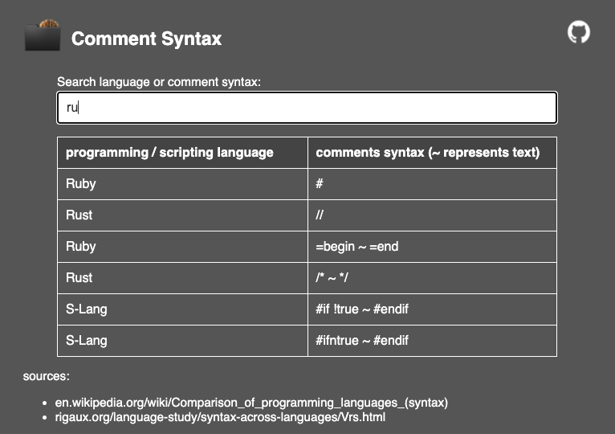

# Comment Syntax Finder
Web page listing inline and block comments for about 777 programming and scripting languages.
Filter this list with the search input.

## Remarks
- search input filters both language and syntax
- column "type" shows whether the comment is line (L) or multiline (M) comment

## Sources
- [en.wikipedia.org/wiki/Comparison_of_programming_languages_(syntax)](https:en.wikipedia.org/wiki/Comparison_of_programming_languages_(syntax))
- [rigaux.org/language-study/syntax-across-languages/Vrs.html](https:rigaux.org/language-study/syntax-across-languages/Vrs.html)
- [pldb.com/languages/line-comments-feature.html](https:pldb.com/languages/line-comments-feature.html)
- [pldb.com/languages/multiline-comments-feature.html](https:pldb.com/languages/multiline-comments-feature.html)
